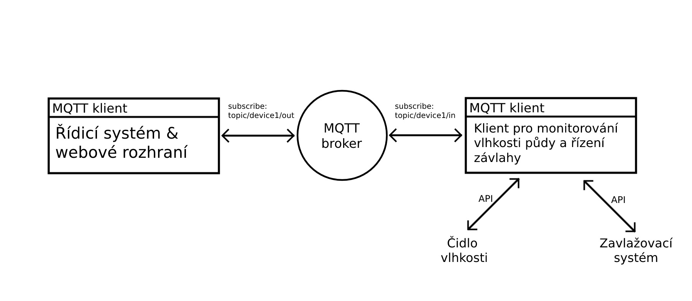

# Úkol 8 - MQTT klient pro monitorování vlhkosti půdy a řízení závlahy

[](https://www.fai.utb.cz/)
[](https://www.java.com/)
[](https://gradle.org/)

|                                  |                                                   |
| -------------------------------- | ------------------------------------------------- |
| __Maximální počet bodů__         | 10 bodů                                           |
| __Způsob komunikace s aplikací__ | Parametry předané při spuštění + síťové připojení |
| __Způsob testování aplikace__    | Na základě odesílaných MQTT zpráv po síti         |

---

## 📝 Zadání úkolu 

Implementujte MQTT klienta pro monitorování vlhkosti půdy a řízení závlahy v zemědělských prostředích. Klient bude pravidelně odesílat zprávy obsahující aktuální naměřené hodnoty vlhkosti půdy a přijímat příkazy pro řízení zavlažovacích systémů. Senzor vlhkosti a zavlažovací systém nebude v rámci této úlohy fyzicky k dispozici, ale budou virtuálně simulovány v programu. Pro obě tyto zařízení budete mít již v repozitáři připravené funkční softwarové komponenty. 

Pro vlastní testování je i součásti repozitáře testovací MQTT klient, kterého můžete spustit příkazem `java -jar TestingMQTTClient.jar`, který umožňuje zobrazovat a manuálně odesílat zprávy na vámi programovaného klienta. Bližší návod na používání v tomto nástroji zadání příkazu `/help` nebo v tomto [souboru](./testing-tool.md).

Náš klient bude v MQTT systému publisher a zároveň i subscriber. A to z tohoto důvodu, že tento klient umožnuje jak čtení hodnot z čidel, tak i zajišťuje řízení závlahy z jiného zařízení. Hlavní řídící systém a zárověn i webové rozhraní bude toto zařízení monitorovat a i řídit jeho chod. V rámci této úlohy však je cílem implementace pouze klienta, který je ve schématu na pravé straně.

Klient, kterého budete implementovat, bude odebírat tento topic __"topic/device1/in"__. Tento topic bude u našého klienta vyhrazen čiste pro příchozí zprávy. Pro odchozí zprávy zde bude využívan topic __"topic/device1/out"__.



### Požadavky:
* Klient se připojí k MQTT brokeru, který v rámci tohoto úkolu bude virtuálně hostovaný na lokálním zařízení. Adresu připojení nastavte následující ```tcp:/localhost:1883```.
* Implementujte zpracování přijímání a odesílání zpráv a také logiku jejich následného zpracovaní. 
* MQTT klient bude hodnotu vlhkosti naměřené z čidla pravidelně odesílat po __10 sekundovém__ intervalu. První odeslaná hodnota bude hned po _spuštění_ klienta. Systém, který bude zpracovávat tyto naměřené data, může také zažádat o okamžité zaslání hodnoty.
* Při příchodu zprávy pro spuštění závlahy klient tuto akci okamžitě provede. Zavlažování bude trvat tak dlouho, dokud neuplyne časový limit __30 sekund__ od poslední přijaté zprávy pro zahájení závlahy. __Zavlažování bude ukončeno okamžitě v případě, kdy přijde zpráva pro okamžité zastavení.__
* Klient bude řídicí systém informovat o úspěšném __spuštění zavlažování a jeho zastavení__ prostřednictvím odesílaných stavových zpráv.
* Klienta bude možné požádat o zaslání stavu o zavlažování. Tedy zda je zavlažování v aktuální okamžik aktivováno nebo ne.
* Pokud dojde k nějaké poruše čidla nebo zavlažovacího systému, musí klient tuto skutečnost oznámit odeslání stavové zprávy s touto chybou.

### Zprávy a jejich struktura

V následující tabulce jsou popsány všechny zprávy, prostřednictvím kterých bude tento MQTT klient komunikovat s okolními systémy. Data odesílaných zpráv budou vždy v následujícím formátu:

 ```<název zprávy>;<hodnota parametru zprávy>```.

| Zpráva                                | Popis                                                                     | Struktura                                | Typ zprávy |
| ------------------------------------- | ------------------------------------------------------------------------- | ---------------------------------------- | ---------- |
| Odeslání hodnoty vlhkosti             | Zpráva obsahující hodnotu naměřené vlhkosti z čidla.                      | Struktura: `humidity;<hodnota vlhkosti>` | OUT        |
| Okamžité zaslání vlhkosti             | Zpráva pro vyžádání okamžitého zaslání aktuální hodnoty vlhkosti.         | Struktura: `get-humidity`                | IN         |
| Vyžádání stavu                        | Zpráva pro vyžádání zaslání stavu zavlažování. Zda je, nebo není aktivní. | Struktura: `get-status`                  | IN         |
| Spuštění závlahy                      | Zpráva pro spuštění zavlažování.                                          | Struktura: `start-irrigation`            | IN         |
| Zastavení závlahy                     | Zpráva pro okamžité zastavení zavlažování.                                | Struktura: `stop-irrigation`             | IN         |
| Stavová zpráva - Závlaha aktivována   | Zpráva informující o tom, že je zavlažování aktivováno.                   | Struktura: `status;irrigation_on`        | OUT        |
| Stavová zpráva - Závlaha deaktivována | Zpráva informující o tom, že je zavlažování deaktivováno.                 | Struktura: `status;irrigation_off`       | OUT        |
| Stavová zpráva - Chyba                | Zpráva informující o výskytu chyby čidla nebo zavlažovacím systému.       | Struktura: `fault;<typ chyby>`           | OUT        |

Tento repozitář již obsahuje základní strukturu. Typy chyb a jednotky, ve kterých čidlo vlhkosti měří, se nachází v šabloně připraveny k použití. Při odesílání hodnoty vlhkosti do zprávy zapište RAW hodnotu, kterou vám poskytne předpřipravené API tohoto čidla. API k čidlu a zavlažovacímu systému a jejich popis se nacházeji ve složce __API__ ve zdrojovém kódu.

### Struktura pole vstupních parametrů
1. __args[0]__ - Seed pro generování náhodných čísel. Využíváno k simulaci modolů. _(long)_
2. __args[1]__ - Poruchovost čidla vlhkosti. Číslo je v rozsahu od 0 po 1 a udává pravděpodobnost, že při čtení hodnoty vlhkosti dojde k jeho poškození. _(float)_
3. __args[2]__ - Poruchovost zavlažovacího systému. Číslo je v rozsahu od 0 po 1 a udává pravděpodobnost, že při libovolné manipulaci (spuštění/zastavení) dojde k jeho poškození. _(float)_

### Do následující třídy implementujte klienta
```java
package utb.fai;

import org.eclipse.paho.client.mqttv3.MqttClient;
import utb.fai.API.HumiditySensor;
import utb.fai.API.IrrigationSystem;

/**
 * Trida MQTT klienta pro mereni vhlkosti pudy a rizeni zavlazovaciho systemu. 
 * 
 * V teto tride implementuje MQTT klienta
 */
public class SoilMoistureMQTTClient {

    private MqttClient client;
    private HumiditySensor humiditySensor;
    private IrrigationSystem irrigationSystem;

    /**
     * Vytvori instacni tridy MQTT klienta pro mereni vhlkosti pudy a rizeni
     * zavlazovaciho systemu
     * 
     * @param sensor     Senzor vlhkosti
     * @param irrigation Zarizeni pro zavlahu pudy
     */
    public SoilMoistureMQTTClient(HumiditySensor sensor, IrrigationSystem irrigation) {
        this.humiditySensor = sensor;
        this.irrigationSystem = irrigation;
    }

    /**
     * Metoda pro spusteni klienta
     */
    public void start() {

    }

}
```

>_**Poznámka:** V této úloze dodržujte danou strukturu kódu aplikace. Součástí vašeho klienta jsou také moduly obsahující API k čidlu a zavlažovacímu systému. U modulů jde o simulaci a něktré jevy, které mohou nastat, jsou pseudonáhodné. Tyto moduly vyžadují při spuštění klienta konfiguraci v podobě počátečních podmínek a seedu. Hodnotící nástroj si tyto podmínky v průběhu testování nastaví sám._

---

## 🏆 Způsob hodnocení

Vaše implementace bude hodnocena na základě chování aplikace při testování různých scénářů. Automatizovaný testovací nástroj bude předávat vaší aplikaci různé parametry, včetně platných a neplatných, aby otestoval její chování za různých podmínek. V případě testování síťové komunikace mezi více klienty, testovací nástroj bude vytvářet virtuální klienty/servery za účelem ověření funkcionality.

Výsledné hodnocení bude záviset na celkovém počtu úspěšných testovacích případů. Počet bodů získaných z úlohy bude tedy záviset na celkové úspěšnosti při testování. Váš výsledný počet bodů bude určen následujícím vzorcem.

__VP__ = __MB__ * (__UT__ / __CPT__)

### Popis symbolů:

* __VP:__ Výsledný počet bodů.
* __MB:__ Maximální počet bodů pro danou úlohu.
* __UT:__ Počet úspěšných testovacích případů.
* __CPT:__ Celkový počet testovacích případů.

## ⚙️ Jak spustit automatizované hodnocení lokálně na svém počítači?

Automatizované hodnocení můžete spustit lokálně za účelem ověření funkčnosti vaší aplikace. K tomu slouží předpřipravený skript, který je dostupný v repozitáři tohoto úkolu. Výsledný report testování se bude nacházet v souboru ```test_report.html```.

###  Pro uživatele systému Linux:
Spusťte skript s názvem ```run_local_test.sh```.

### Pro uživatele systému Windows:
Spusťte skript s názvem ```run_local_test.bat```.

